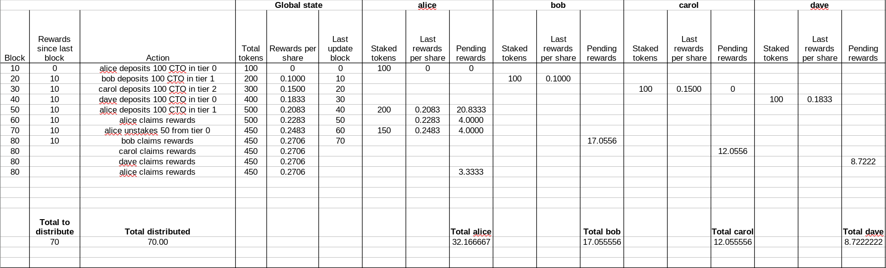

## Testing using xSuite:

Please add five PEM keys named "signer", "alice, "bob", "carol" and "dave" in the wallets folders in order to test the smart contracts in this project.

Complex scenario found in tests:

